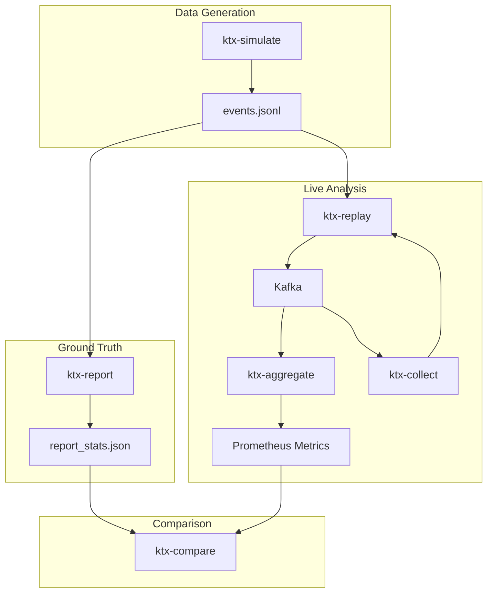

# Transaction Insights (`ktxinsights`)

`ktxinsights` is a specialized, open-source toolkit for bridging the critical observability gap in Apache Kafka's transactional systems. It moves beyond infrastructure-level metrics to provide a high-level, business-aware view of your transactional workflows.

## The Problem: The Transaction Observability Gap

While Kafka's Exactly-Once Semantics (EOS) provide robust data integrity guarantees, they create a "black box" for developers and SREs. It's difficult to correlate a high-level business process (e.g., an e-commerce order) with the low-level state of a specific Kafka transaction on a broker. This leads to prolonged debugging, reduced reliability, and an inability to define meaningful, business-centric SLAs.

`ktxinsights` is designed to solve this problem by providing a unified view that correlates business transaction semantics with Kafka's infrastructure state.

## Core Features

*   **Dual-Consumer Architecture:** The heart of `ktxinsights`. It runs two consumers in parallel—one `read_uncommitted` and one `read_committed`—to build a sophisticated state machine for each business transaction. This allows for the reliable detection of not just successful commits, but also **aborted transactions** that are often invisible to standard monitoring.

*   **Transactional Integrity & Watermarks:** We introduce the concept of **"Transactional Integrity"**—a measure of how closely the committed reality of the system matches the intended business logic. This is quantified with novel metrics:
    *   **Transactional Integrity Lag (TIL):** The time difference between the newest and oldest unresolved transactions.
    *   **P95 Unresolved Transaction Age:** A more robust, percentile-based metric indicating the age of the 95th percentile oldest unresolved transaction, providing a clear signal of systemic health.

*   **Coordinator Collector:** A robust service that connects to the Kafka cluster's Admin API to fetch the list of ongoing transactions directly from the transaction coordinator. This provides an infrastructure-level source of truth to confirm aborted transactions and prevent false positives.

*   **"Generate then Replay" Validation:** A powerful methodology for performance analysis. It uses a ground-truth benchmark generated from a simulation to precisely quantify the performance overhead of your Kafka infrastructure, distinguishing it from application-level latency.

## How It Works

The toolkit is composed of several components that work together to provide end-to-end visibility.



1.  **`ktx-simulate`**: Generates a realistic workload scenario as an `events.jsonl` file.
2.  **`ktx-report`**: Analyzes the `events.jsonl` file to create a ground-truth performance benchmark.
3.  **`ktx-replay`**: Publishes the scenario to a live Kafka cluster with faithful timing.
4.  **`ktx-collect`**: Polls the Kafka Admin API for the state of ongoing transactions.
5.  **`ktx-aggregate`**: Consumes the live event stream (using the dual-consumer model) and coordinator state, builds the transaction state machine, and exposes metrics via Prometheus.
6.  **`ktx-compare`**: Fetches the live metrics and compares them against the ground-truth benchmark, producing a report that quantifies infrastructure overhead and highlights discrepancies.

## Configuration

All configuration files are located in the `config/` directory. Copy a template to create a new environment configuration.

*   `config/ccloud.properties.template`: For Confluent Cloud.
*   `config/local.properties.template`: For a local Kafka installation.
*   `config/cp-all-in-one.properties.template`: For a local `cp-all-in-one` Docker environment.

## Usage

### Local Analysis (No Kafka Required)

The `run_local_analysis.sh` script provides a self-contained way to test the toolkit's logic.

```bash
./ccloud-testing/run_local_analysis.sh
```

This script will generate a test scenario, run the aggregator in file-reading mode, and produce a comparison report in the console and as an HTML file.

### Live Kafka Cluster Analysis

The `run_analysis_test.sh` script runs the full toolkit against a live Kafka cluster.

```bash
./ccloud-testing/run_analysis_test.sh <path_to_config.properties> <scenario_script>
```

**Example:**
```bash
./ccloud-testing/run_analysis_test.sh config/ccloud.properties scenarios/01_high_throughput.sh
```

This will start all services, replay the chosen scenario to your cluster, and generate a comparison report.

## Security and ACLs

`ktxinsights` requires specific permissions to operate against a secure Kafka cluster.

### Coordinator Collector (`collector.py`)

*   **CLUSTER:DESCRIBE**: To list and describe transactions.
*   **TOPIC:PRODUCE**: On the `ktxinsights.coordinator.state` topic to publish its findings.
*   The collector runs in `--read-only` mode by default and will not attempt to alter state.

### Aggregator (`aggregator.py`)

*   **GROUP:READ**: On its consumer groups (e.g., `ktxinsights-monitor-group`).
*   **TOPIC:READ**: On the input topics (`workflow.transactions`, `workflow.steps`, `ktxinsights.coordinator.state`).
