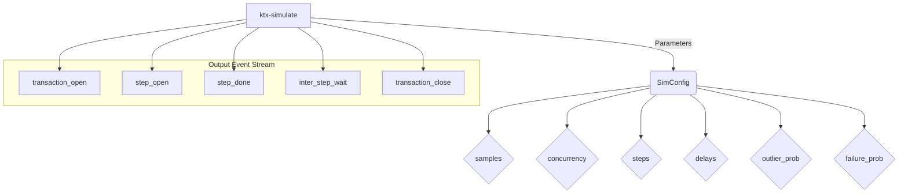
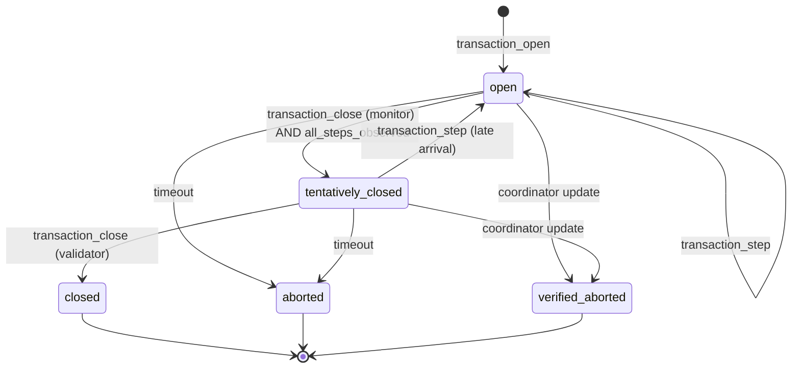
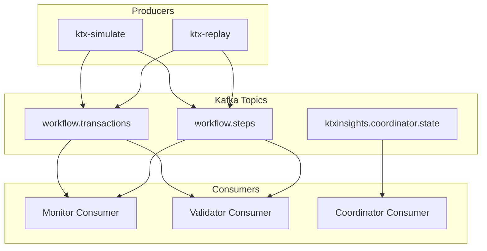
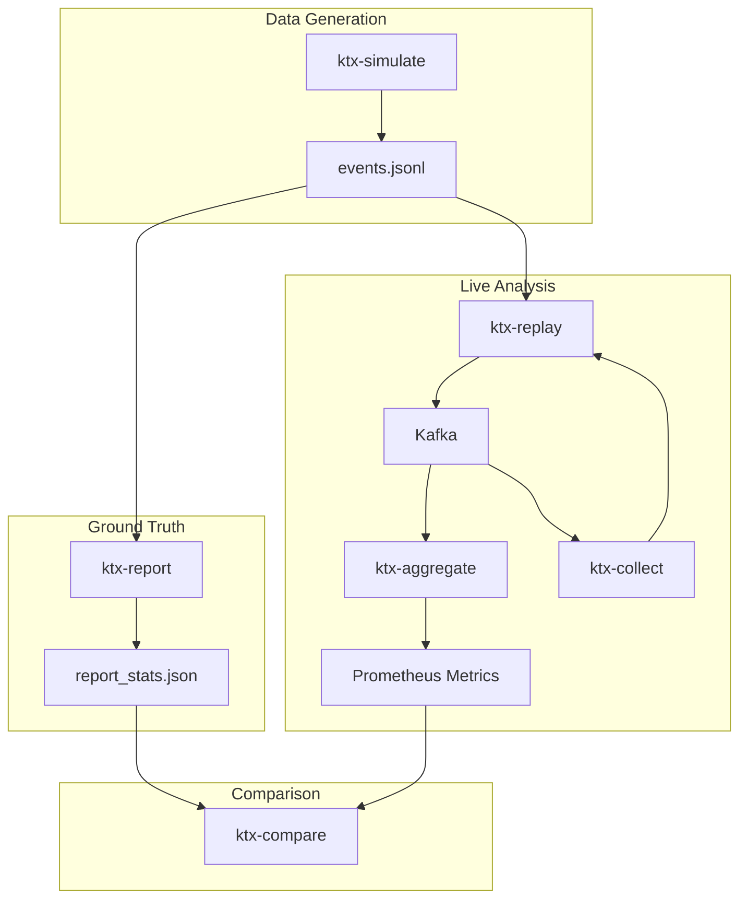
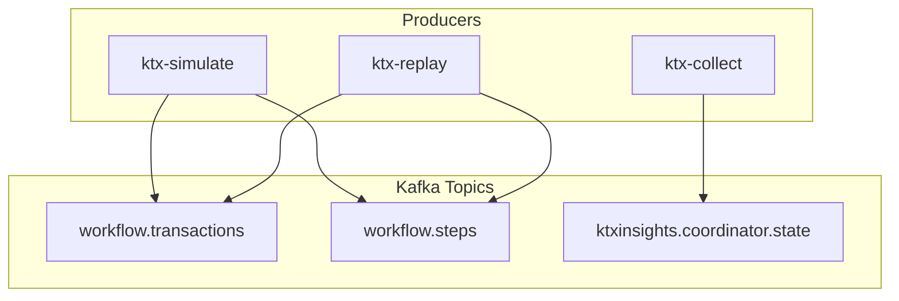
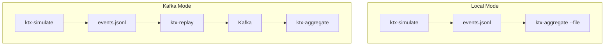

## Abstract

While Apache Kafka's transactional capabilities provide robust guarantees for data integrity, they introduce a critical observability gap between the low-level state of a broker's transaction coordinator and the high-level business workflows they represent. This paper introduces `ktxinsights`, a **specialized**, open-source toolkit designed to bridge this gap. Our approach utilizes a novel **dual-consumer architecture** to correlate `read_uncommitted` and `read_committed` event streams, enabling the real-time tracking of business transactions through their complete lifecycle. This allows us to move beyond simple success/failure metrics and introduce the concept of **"Transactional Integrity,"** a measure of how closely the committed reality of the system matches the intended business logic. We propose a new set of **"Transactional Watermark"** metrics to quantify this integrity in real-time. We also present a **"Generate then Replay"** methodology for validation, which uses a ground-truth benchmark to precisely quantify the performance overhead of the Kafka infrastructure. A comparison with existing infrastructure-centric tools demonstrates that our business-aware approach provides a more accurate and actionable view of transactional health.

## 1\. Motivation: The Transaction Observability Gap

Modern distributed systems increasingly rely on Apache Kafka for asynchronous communication and data integration. The introduction of Exactly-Once Semantics (EOS) and transactional capabilities was a landmark feature, providing strong guarantees for data integrity across multi-topic operations. However, these powerful features have also created a significant challenge: a critical **observability gap** between the state of a low-level Kafka transaction and the business-level workflow it underpins.

This gap creates a black box where application developers and SREs have a disconnected view of the system. SREs can see infrastructure-level metrics (e.g., commit rates, consumer lag), while developers can see application logs, but neither can easily correlate a failed business process (e.g., an e-commerce order) to a specific aborted transaction on the broker without significant manual effort. This leads to prolonged debugging cycles, reduced system reliability, and an inability to define meaningful, business-centric SLAs.

The fundamental problem is the **lack of a unified view that correlates high-level business transaction semantics with low-level Kafka infrastructure state.** This paper presents a solution designed not only to bridge this gap, but also to introduce a new, more holistic way of measuring the health of transactional systems.

## 2\. Theoretical Background

To understand our approach, it is essential to first understand the mechanics of Kafka's transactional protocol and the role of the Transaction Coordinator.

### 2.1. The Kafka Transaction Protocol

Kafka's transactional capabilities are designed to enable atomic writes to multiple topics and partitions. The protocol involves a series of interactions between the Kafka producer, the Transaction Coordinator, and the topic partitions.

1.  **`InitProducerId`:** The producer requests a unique Producer ID (PID) and an epoch from the Transaction Coordinator. This makes the producer idempotent, preventing duplicate messages in the event of retries.
2.  **`BeginTransaction`:** The producer signals its intent to start a transaction.
3.  **`Produce`:** The producer sends a series of messages to the target topics. These messages are marked as part of the transaction but are not yet visible to `read_committed` consumers.
4.  **`CommitTransaction` / `AbortTransaction`:** The producer signals the end of the transaction. The Transaction Coordinator then begins a two-phase commit process:
      * **Phase 1 (Prepare):** The Coordinator writes a "prepare\_commit" or "prepare\_abort" marker to its internal transaction log.
      * **Phase 2 (Write Markers):** The Coordinator writes "commit" or "abort" markers to the user-facing topic partitions. Once these markers are written, `read_committed` consumers will either be able to read the transactional messages or will skip them, respectively.

A detailed explanation of the protocol can be found in the official Kafka documentation and Confluent's developer resources [1, 2].

### 2.2. The Transaction Coordinator

The Transaction Coordinator is a module that runs on every Kafka broker. Each `transactional.id` configured in a producer is mapped to a specific partition of the internal `__transaction_state` topic. The leader of that partition becomes the Transaction Coordinator for all transactions with that `transactional.id`.

The Coordinator's primary responsibilities are:

  * Managing the lifecycle of a transaction (e.g., `Ongoing`, `PrepareCommit`, `CompleteCommit`).
  * Persisting the state of each transaction to its internal log.
  * Fencing out "zombie" producers (i.e., older instances of a producer that may have been restarted) by using the PID and epoch.

Understanding the role of the Coordinator is crucial, as it is the ultimate source of truth for the state of a transaction at the infrastructure level. Our `CoordinatorCollector` component is designed to query this source of truth directly.

### 2.3. Offsets, Watermarks, and Consumer Lag

A core concept in Kafka is the **offset**, which is a unique, sequential ID assigned to each message within a partition. Consumers track their progress by committing the offset of the last message they have successfully processed.

For transactional systems, two offsets are critical:

  * **High Watermark (HW):** The offset of the last message physically written to a partition's log. This is the replication boundary.
  * **Last Stable Offset (LSO):** The offset of the last message that is part of a successfully committed transaction. This is the consumer-visible boundary for `read_committed` consumers.

**Validator lag and correctness must be measured vs LSO.** Equating HW with LSO is a common monitoring anti-pattern that leads to skewed lag metrics and incorrect "not seeing messages" diagnoses. The `ktxinsights` toolkit's validator consumer is specifically designed to measure its lag against the LSO, providing an accurate view of transactional processing health.

## 3\. Our Approach: The `ktxinsights` Toolkit

To address this challenge, we have developed `ktxinsights`, a Python-based toolkit for end-to-end transaction visibility. Our approach is centered around two key innovations: a dual-consumer architecture for state tracking and a "Generate then Replay" methodology for validation.

### 3.1. Dual-Consumer Architecture

The core of our solution is a `TransactionAggregator` service that runs two Kafka consumers in parallel against the same event stream:

1.  **The Monitor Consumer (`isolation.level=read_uncommitted`):** This consumer gets a real-time view of all events as they are produced, even before the transaction is committed. It is responsible for tracking "in-flight" transactions and marking them as "tentatively closed" as soon as the final business event is observed.
2.  **The Validator Consumer (`isolation.level=read_committed`):** This consumer only sees events after the transaction has been successfully committed by the broker. It provides the "ground truth" and is used to confirm that a tentatively closed transaction is officially `Closed`.

By reconciling the event streams from these two consumers, the aggregator can build a sophisticated state machine for each business transaction, reliably detecting not only successful commits but also **aborted transactions**—those that are seen by the monitor but never by the validator. This state machine is designed to be **resilient**, correctly handling out-of-order and late-arriving events by reverting transaction states when necessary, ensuring an accurate final picture even in complex scenarios.

### 3.2. The Coordinator Collector

To achieve a complete picture, our architecture includes a `CoordinatorCollector` service. This component is designed for robust, production-ready operation. It connects to the Kafka cluster's Admin API and polls for the list of ongoing transactions.

**Operational Considerations:**

  * **Polling Strategy:** The collector uses a configurable poll interval (e.g., 15-30 seconds) with exponential backoff and jitter to handle transient broker issues gracefully and avoid creating "thundering herd" problems.
  * **Filtering and Overhead:** In a multi-tenant cluster, fetching all transactions can be expensive. The collector can filter transactions based on `transactional.id` prefixes or regular expressions, allowing operators to focus on specific services and minimize overhead.
  * **Permissions and Restricted Environments:** The collector requires `CLUSTER:DESCRIBE` ACLs to function. In restricted environments where such permissions are not granted, the collector can be run in a `--read-only` mode (the default), where it will not attempt any state-altering operations. It fails gracefully with clear error messages if permissions are insufficient.

This infrastructure-level truth is published to an internal topic and consumed by the aggregator, allowing for a three-way correlation between the application's intended state, the committed state, and the broker's internal state. This confirmation from the coordinator is crucial for **preventing false positives**; it allows the system to distinguish between a transaction that has merely timed out from the aggregator's perspective (`aborted`) and one that has been definitively terminated by the broker (`verified_aborted`), providing operators with higher-fidelity alerts.

### 3.3. Assumptions and Simplifications

The `ktxinsights` model relies on a set of simplifying assumptions to provide its focused view of transactional health:

  * **Transaction Definition:** We assume that a "business transaction" can be uniquely identified by a single Kafka `transactional.id`. Workflows that span multiple `transactional.id`s are not currently correlated into a single view.
  * **Structured Event Schema:** The toolkit expects that the application's event stream adheres to a specific, structured schema, including distinct `transaction_open`, `transaction_close`, and `transaction_step` event types. This requires some degree of application instrumentation.
  * **Known Transaction Steps:** For multi-step transaction analysis, the current implementation assumes that the set of expected steps for a given transaction type is known in advance. While this is currently hardcoded, a future improvement would be to make this dynamically configurable.

These assumptions allow the toolkit to maintain a simple, effective, and stateful model of business transactions without the full complexity of a general-purpose distributed tracing system.

## 4\. Reflections on Measuring Transactional Health

The dual-consumer architecture does more than just identify aborted transactions; it enables a more sophisticated and holistic understanding of transactional health. By observing the full lifecycle of every transaction, we can move beyond simple success rates and introduce new, more powerful metrics.

### 4.1. Transactional Integrity and Timestamps

We propose the concept of **"Transactional Integrity"** as a measure of how closely the committed reality of the system matches the intended business logic. A system with high integrity has a minimal number of transactions that are either aborted or "in-flight" for an extended period.

To quantify this, we introduce two complementary metrics:

  * **Transactional Integrity Lag (TIL):** The difference between the newest and oldest unresolved transaction timestamps (`Max - Min`). While simple to understand, this metric can be misleading. A single, genuinely stuck transaction from hours ago would keep the minimum timestamp artificially low, resulting in a massive TIL. This would obscure the fact that 99.9% of recent transactions might be processing perfectly.

  * **P95 Unresolved Transaction Age:** A more robust, percentile-based metric that represents the age of the 95th percentile oldest unresolved transaction. This metric is far less volatile and provides a better indicator of systemic health. If the P95 age is low, it means that the vast majority of transactions are resolving quickly. A rising P95 age is a clear and reliable indicator of a widespread processing issue, while being immune to the effects of a single outlier. Operationally, **a gradual increase might suggest systemic slowdown or resource saturation, whereas a sudden spike often points to a downstream failure or a stalled consumer**.

### 4.2. End-to-End Transaction Lifetime Distribution

Traditional performance monitoring often focuses on the duration of successful transactions. This creates a survivorship bias, where the performance of failed or aborted transactions is ignored.

Our approach allows us to measure the **"End-to-End Transaction Lifetime"** for *every* transaction, from the moment it is opened to the moment it reaches a terminal state (`Closed` or `Aborted`). By plotting a histogram of these lifetimes, we can get a complete and unbiased picture of our system's performance, including the impact of failures.

## 5\. Validation and Measurement

A key challenge in performance analysis is distinguishing between application-level latency and infrastructure overhead. To solve this, we employ a **"Generate then Replay"** methodology:

1.  **Generate:** A `ktx-simulate` tool generates a high-volume, realistic workload scenario, complete with random delays and outliers. The output is persisted as an `events.jsonl` file.
2.  **Benchmark:** A `ktx-report` tool analyzes this file directly to create a **ground-truth benchmark**. This report represents the ideal performance profile of the workload, free from any system latencies.
3.  **Replay:** A `ktx-replay` tool publishes the `events.jsonl` file to a live Kafka cluster, faithfully reproducing the original timing and load profile.
4.  **Measure:** The `ktx-aggregate` service monitors the live traffic and exposes its measurements via a Prometheus endpoint.
5.  **Compare:** A `ktx-compare` tool fetches the live metrics and compares them against the ground-truth benchmark, producing a report that precisely quantifies the overhead of the Kafka infrastructure and highlights any discrepancies (e.g., aborted transactions).

Applying this methodology with the High-Throughput scenario (Scenario 01) on our test cluster revealed a median infrastructure overhead of 18ms for the end-to-end transaction lifetime. The `ktx-compare` tool highlighted that while the ground-truth benchmark contained zero failures, the live replay resulted in 0.02% of transactions being aborted due to transient timeouts under load. This demonstrates the toolkit's ability to not only quantify typical performance but also to detect rare, infrastructure-induced failures that would otherwise be invisible.

## 6\. Comparison with the Observability Ecosystem

The `ktxinsights` toolkit is not designed to replace existing monitoring tools but to fill a specific gap in the observability of business workflows that rely on Kafka transactions. A fair comparison requires positioning it against two distinct categories of tools: Kafka-specific infrastructure monitors and general-purpose application tracing frameworks.

-----

### 6.1. Complementing Infrastructure-Level Monitors

Tools like **`kminion` and `kafka-lag-exporter`** are essential for monitoring the fundamental health of a Kafka cluster. They excel at answering infrastructure-centric questions:

  * Is a consumer group falling behind?
  * What is the end-to-end throughput of a topic?
  * Are the brokers healthy?

However, their perspective is fundamentally business-agnostic. They can report that a consumer's offset matches the Last Stable Offset (LSO) and therefore has zero lag, giving the impression of a healthy system. Yet, as demonstrated in the silent failure example, this can mask a critical application-level problem where transactions are being aborted by the broker.

`ktxinsights` acts as a **complementary layer** to these tools. While an infrastructure monitor might alert on high consumer lag, `ktxinsights` can pinpoint the direct business impact by identifying exactly which transactions are "in-flight" or have been stuck for an extended period. It translates an infrastructure signal ("lag is growing") into a business insight ("Order finalization transactions are not being committed").

-----

### 6.2. A State-Oriented Alternative to Distributed Tracing

The most relevant paradigm for monitoring workflows across services is **distributed tracing**, with **OpenTelemetry** being the industry standard. In a tracing model, a business workflow is captured as a "trace," and each operation (e.g., an API call, a database query, producing a Kafka message) is a "span" within that trace. This approach provides a powerful, flow-centric view of how a request propagates through a system.

An application could leverage distributed tracing to monitor Kafka transactions by creating a parent span for the business workflow and adding the Kafka `transactional.id` as a tag or attribute. This is a valid and robust alternative for observing system behavior.

However, `ktxinsights` offers a different and more specialized perspective:

  * **State-Centric vs. Flow-Centric View:** Distributed tracing is fundamentally **flow-centric**; it shows the path and timing of operations. `ktxinsights`, by contrast, is **state-centric**. Its primary purpose is to build and maintain a formal state machine for each business transaction, tracking its lifecycle from `open` to `tentatively_closed` to a terminal `closed` or `aborted` state. This provides a direct, aggregate view of the business reality (e.g., "How many orders are currently awaiting final confirmation?") that is not the primary focus of tracing systems.

  * **Deep Kafka Integration:** The toolkit's insights are derived from its deep integration with Kafka's transactional mechanics. The **dual-consumer architecture** leverages the semantic difference between `read_uncommitted` and `read_committed` isolation levels to definitively track a transaction's journey from "in-flight" to "committed." This Kafka-native approach provides a precise ground truth that can be more difficult to assemble from the general-purpose instrumentation of a tracing system.

  * **Purpose-Built Metrics:** Concepts like **"Transactional Integrity"** and the resulting **"Transactional Integrity Lag (TIL)"** metric are direct outputs of the `ktxinsights` stateful model. While one could potentially build similar metrics from tracing data, they are a native, first-class concept within this toolkit, designed specifically to quantify the "time window of uncertainty" in a transactional workflow.

In summary, `ktxinsights` does not compete with distributed tracing but rather offers an opinionated, state-oriented alternative for teams whose primary concern is the lifecycle and integrity of business transactions as they are materialized within Kafka's transactional protocol.

## 7\. Conclusion

This paper has addressed the critical observability gap in Kafka, providing a definitive solution to the problem of **'silent failures'** where conventional metrics report a healthy system while business transactions are being aborted. The `ktxinsights` toolkit provides this solution by combining a dual-consumer architecture with a rigorous "Generate then Replay" validation methodology, delivering a level of insight that is not possible with traditional, infrastructure-focused monitoring tools. This approach enables teams to build more reliable, performant, and debuggable event-driven systems on top of Kafka.

It is important to note that while KIPs like KIP-890 and KIP-714 are actively improving the robustness and observability of Kafka's transactional capabilities at the protocol and client levels, they do not render the `ktxinsights` approach obsolete. On the contrary, they highlight the growing importance of transactional monitoring.

The `ktxinsights` toolkit is not a replacement for these low-level improvements. Instead, it is a complementary tool that provides a higher-level, business-centric view of transactional health. While KIPs strengthen the foundation, `ktxinsights` provides the tools to verify that these foundational improvements are translating into real-world benefits for your business applications. It answers the question, "Is my business process, as a whole, behaving as expected?"—a question that cannot be answered by infrastructure-level metrics alone.

As Kafka continues to evolve, the need for tools that can bridge the gap between the infrastructure and the business will only grow. The `ktxinsights` toolkit is a valuable step in that direction.

## 8\. Outlook

While the `ktxinsights` toolkit provides a significant step forward in transactional observability, there are still several areas where the Kafka ecosystem could be improved. Future work in this area could include:

  * **Enhanced Coordinator/Broker Metrics:** While the `CoordinatorCollector` provides a snapshot of ongoing transactions, more detailed metrics from the broker itself would be invaluable. This could include metrics on commit/abort rates, the latency of commit operations, and the "transaction log lag"—the delay between a transaction being prepared and the final markers being written.

  * **Advanced Alerting:** The data collected by `ktxinsights` could be used to build sophisticated alerting systems. For example, alerts could be triggered for transactions that remain open beyond a certain threshold, or for producers that have a high rate of aborted transactions.

  * **Integration with Distributed Tracing:** Rather than creating a separate tracing solution, the `ktxinsights` aggregator could be enhanced to emit its state transitions (`open`, `closed`, `aborted`) as events or spans within a broader OpenTelemetry trace. This would enrich existing traces with a high-fidelity, state-centric view of the Kafka transaction lifecycle, combining the best of both paradigms.

  * **Improved Recovery Visibility:** For stateful applications using Kafka Streams, more visibility into the recovery process after a failure would be beneficial. This could include metrics on how long it takes for state stores to recover, and tools for detecting data loss or duplication in an EOS setup.

  * **Enhanced Admin Tools:** The Kafka Admin API provides the foundation for building powerful tools for managing transactions. Future work could include building CLI or REST-based tools for inspecting in-flight transactions, or even for manually aborting hung transactions.

The `ktxinsights` toolkit provides a solid foundation for building these and other advanced transactional monitoring capabilities. As more and more critical business applications are built on top of Kafka, the need for this kind of deep, business-aware observability will only continue to grow.

## References

[1] Apache Kafka Documentation. "Transactions in Kafka." Accessed September 17, 2025. [https://kafka.apache.org/documentation/\#transactions](https://kafka.apache.org/documentation/#transactions)

[2] Confluent, Inc. "Transactions in Apache Kafka." Accessed September 17, 2025. [https://www.confluent.io/blog/transactions-in-apache-kafka/](https://www.confluent.io/blog/transactions-in-apache-kafka/)

## Appendix A: Test Scenarios

The `ktxinsights` toolkit includes a suite of test scenarios to validate its functionality and demonstrate its capabilities in a variety of simulated environments.

### Scenario 00: Minimal

This is a simple, deterministic scenario designed to verify the core logic of the toolkit. It consists of a small number of transactions with fixed timings and no failures, making it easy to confirm that the aggregation and reporting tools are working as expected.

### Scenario 01: High-Throughput

This scenario simulates a high-volume, low-latency system. It is characterized by high concurrency, short processing times, and a very low probability of outliers. This scenario is useful for stress-testing the toolkit and evaluating its performance under heavy load.

### Scenario 02: Slow, Complex Workflow

This scenario simulates a system with long-running, complex transactions. It is characterized by a higher number of steps per transaction, lower concurrency, and long processing times. This scenario is useful for evaluating the toolkit's ability to track long-running transactions and identify bottlenecks in complex workflows.

### Scenario 03: Unreliable or "Spiky" System

This scenario simulates a system that performs well on average but suffers from frequent, severe hiccups. It is characterized by a high probability of outliers, which introduce significant delays into the transaction processing. This scenario is useful for evaluating the toolkit's ability to identify and quantify the impact of these intermittent performance issues.

### Scenario 00: Minimal with Errors

This scenario is a variation of the minimal scenario that introduces a configurable rate of transaction failures. This is useful for verifying that the toolkit can correctly identify and report on aborted transactions, and for validating the accuracy of the "Transactional Integrity Ratio" metric.

### Scenario 05: LSO Stall

This scenario simulates a producer that successfully writes several messages in a transaction but never commits it. It is used to validate that the `validator` consumer correctly stops consuming at the Last Stable Offset (LSO) and that the `ktxinsights_validator_lso_lag` metric accurately reports the growing lag against the LSO.

### Scenario 06: Cross-Partition and Late Events

This scenario models a complex transaction where events are written to multiple topics (or partitions) and one event arrives significantly later than the others, even after the `transaction_close` event has been seen by the monitor. It is used to validate the resilience of the state machine, specifically its ability to wait for all expected steps and to revert from a `tentatively_closed` state back to `open` to correctly process the late-arriving event.

### Scenario 07: Aborted Transaction via Coordinator

This scenario simulates a transaction that is aborted by the broker. It uses a synthetic "coordinator update" event in the test file to mimic the `CoordinatorCollector` reporting that the transaction is no longer active. This is used to validate the `verified_aborted` state transition and confirm that the system correctly identifies transactions that are aborted at the infrastructure level.

## Appendix B: Relation to Kafka Improvement Proposals (KIPs)

The `ktxinsights` toolkit is designed to address observability gaps in Kafka's transactional capabilities. Several Kafka Improvement Proposals (KIPs) are relevant to this work:

  * **KIP-890: Transactions Server-Side Defense:** This KIP strengthens the transaction protocol to be more robust against issues like hanging transactions and zombie producers. While this KIP improves the reliability of Kafka transactions, `ktxinsights` provides the tools to monitor and validate that these improvements are having the desired effect in a production environment.

  * **KIP-892: Transactional Semantics for StateStores:** This KIP aims to improve the robustness of Kafka Streams state stores under Exactly-Once Semantics (EOS). As more applications adopt EOS, the need for tools like `ktxinsights` to monitor the consistency and recovery of these stateful applications will become even more critical.

  * **KIP-714: Client Metrics & Monitoring Enhancements:** This KIP adds more client-side metrics, which can help operators observe the behavior of transactional clients. `ktxinsights` complements this by providing a higher-level, business-centric view of transactional health that is not available through client metrics alone.

  * **KIP-932: Queues for Kafka:** While not directly related to transactions, this KIP introduces new semantics for message acknowledgment and in-flight message tracking. The principles and techniques used in `ktxinsights` could be adapted to monitor the reliability and visibility of messages in these new queueing systems.

The `ktxinsights` toolkit is designed to fill the monitoring gaps that still exist in the Kafka ecosystem, even with these valuable KIPs. By providing a business-aware view of transactional health, it empowers developers and SREs to build more reliable and observable systems on top of Kafka.

## Appendix C: Analysis Flow

This appendix provides a visual overview of the `ktxinsights` analysis flow.

### Data Generator

**How the Data Generator Works:**

The `ktx-simulate` tool generates a stream of events that mimic a real-world transactional workflow. It is configured with a `SimConfig` object that defines the characteristics of the generated data.

**Possible Patterns:**

  * **High-Throughput:** High `samples` and `concurrency`, low `delays`.
  * **Slow, Complex:** High `steps`, low `concurrency`, high `delays`.
  * **Unreliable/Spiky:** High `outlier_prob` and `outlier_ms`.
  * **Failing:** Non-zero `failure_prob`.

### Transaction State Machine

**How the Transaction State Machine Works:**

The `ktx-aggregate` service builds a state machine for each transaction to track its lifecycle, designed to be resilient to out-of-order and late-arriving events.

1.  A transaction enters the `open` state when a `transaction_open` event is received. The aggregator tracks a set of expected steps for the transaction.
2.  As `transaction_step` events arrive, they are recorded.
3.  When the `monitor` consumer sees a `transaction_close` event AND all expected steps have been observed, the state transitions to `tentatively_closed`.
4.  If a `transaction_step` event arrives for a transaction that is already `tentatively_closed` (a late event), the state reverts back to `open` to await the final `transaction_close` event again.
5.  When the `validator` consumer sees the `transaction_close` event for a `tentatively_closed` transaction, the state transitions to `closed`, and the transaction is considered successful.
6.  If a transaction remains in an unresolved state for too long, it is moved to `aborted`.
7.  If the `CoordinatorCollector` reports that a transaction is no longer active on the broker, it is moved to `verified_aborted`.

### Consumers and Topics

**Which Consumer Reads from Which Topic:**

  * **Monitor Consumer (`isolation.level=read_uncommitted`):** Reads from `workflow.transactions` and `workflow.steps` to get a real-time view of all events, including those in uncommitted transactions.
  * **Validator Consumer (`isolation.level=read_committed`):** Reads from `workflow.transactions` and `workflow.steps` to get a view of only committed transactions.
  * **Coordinator Consumer:** Reads from `ktxinsights.coordinator.state` to get the state of ongoing transactions directly from the Kafka brokers.

### Analysis Components

**What Components are Included in the Analysis:**

  * **`ktx-simulate`:** Generates the `events.jsonl` file.
  * **`ktx-report`:** Generates the ground-truth `report_stats.json` file from the `events.jsonl` file.
  * **`ktx-replay`:** Replays the `events.jsonl` file to a Kafka cluster.
  * **`ktx-aggregate`:** Consumes from Kafka and exposes live metrics.
  * **`ktx-collect`:** Fetches coordinator state from Kafka and publishes it to a topic for the aggregator.
  * **`ktx-compare`:** Compares the ground-truth `report_stats.json` with the live metrics from the aggregator.

### Producers and Topics

**When is a Producer Writing to Which Topic:**

  * **`ktx-simulate` & `ktx-replay`:** These tools produce events to the `workflow.transactions` and `workflow.steps` topics. `ktx-simulate` can produce directly to Kafka, while `ktx-replay` reads from a file and produces to Kafka.
  * **`ktx-collect`:** This tool produces the state of ongoing transactions to the `ktxinsights.coordinator.state` topic.

### Local vs. Kafka Mode

**Compare the mode with and without Kafka - what are the differences?**

  * **Local Mode:** The `ktx-aggregate` service reads events directly from a file. This is useful for testing the core logic of the aggregator and for generating reports without the need for a running Kafka cluster.
  * **Kafka Mode:** The `ktx-replay` service reads events from a file and produces them to a Kafka cluster. The `ktx-aggregate` service then consumes these events from Kafka. This mode provides a more realistic test of the entire system, including the performance overhead of the Kafka cluster itself.

## Appendix D: Architectural Considerations and Limitations

While this paper presents `ktxinsights` as a **focused solution**, it is important to acknowledge the architectural trade-offs and operational complexity inherent in its stateful, centralized design.

### Stateful Aggregator as a Bottleneck

The `TransactionAggregator` is a stateful component that must process every relevant event to maintain its in-memory state machine for all in-flight transactions. This design presents a potential performance bottleneck and a single point of failure. The current implementation does not address high availability or horizontal scalability. For a production system handling millions of concurrent transactions, this component would need to be re-architected, for example, by sharding the processing based on `transactional.id` and using a distributed, persistent state store (e.g., Kafka Streams, Flink, or a key-value database) instead of in-memory dictionaries.

### Memory Footprint

In a system with many long-running transactions, the memory required to hold the state for all "Open" or "TentativelyClosed" transactions could become substantial. The current design offers no mechanism for managing this memory footprint and does not persist its state, meaning a restart of the aggregator will lose all visibility into in-flight transactions until they emit new events. A production-ready version would require state persistence and a strategy for managing the lifecycle of old, unresolved transaction states.

### Polling the Coordinator

The `CoordinatorCollector` relies on polling the Admin API. While the implementation includes backoff, jitter, and filtering to minimize impact, polling is inherently less efficient than a push-based or event-driven mechanism. On a large, multi-tenant Kafka cluster with thousands of unique `transactional.id`s, this could still introduce non-trivial load on the brokers and result in stale data between polling intervals. A more advanced solution might involve leveraging broker-level metrics or logs if they were to become available in future Kafka versions.