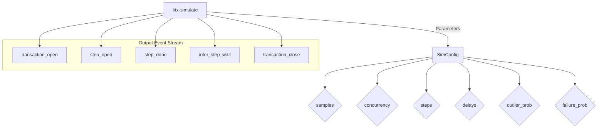
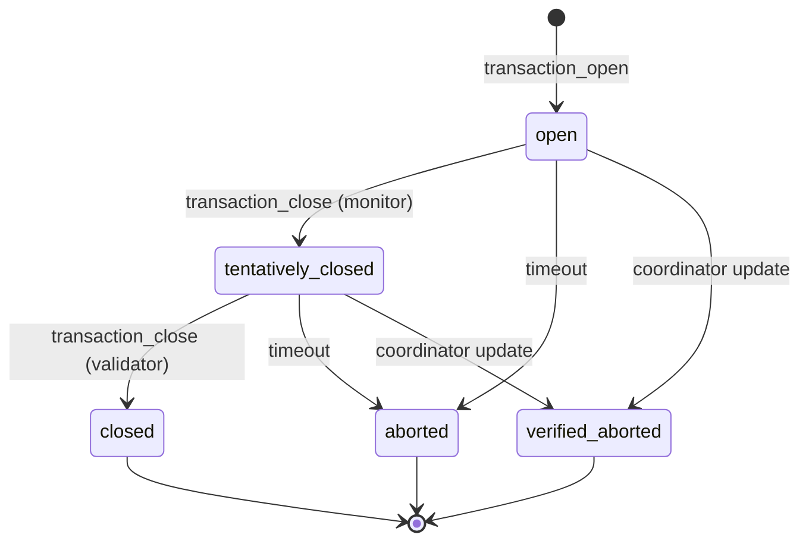
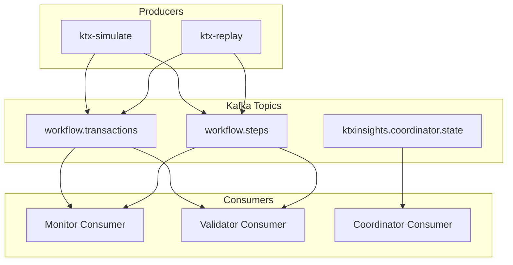
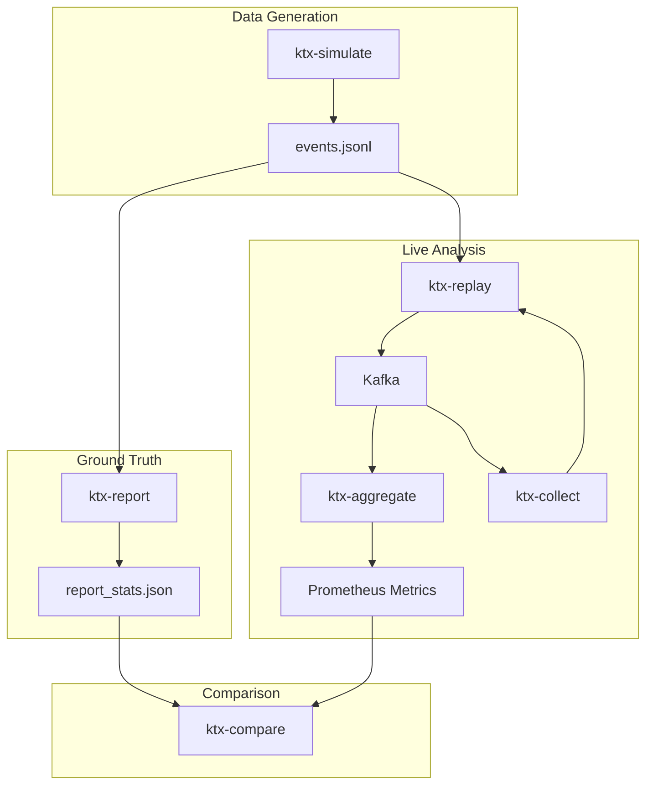
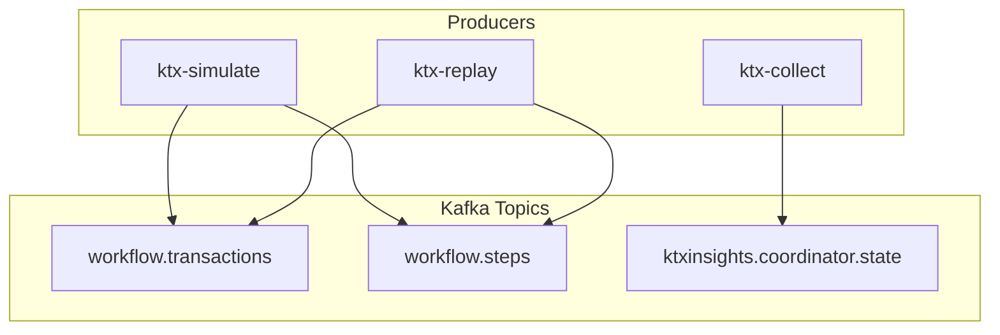
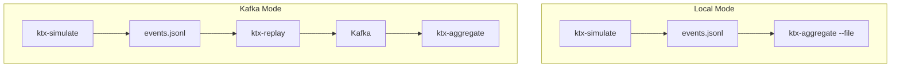

## Abstract

While Apache Kafka's transactional capabilities provide robust guarantees for data integrity, they introduce a critical observability gap between the low-level state of a broker's transaction coordinator and the high-level business workflows they represent. This paper introduces `ktxinsights`, a lightweight, open-source toolkit designed to bridge this gap. Our approach utilizes a novel **dual-consumer architecture** to correlate `read_uncommitted` and `read_committed` event streams, enabling the real-time tracking of business transactions through their complete lifecycle. This allows us to move beyond simple success/failure metrics and introduce the concept of **"Transactional Integrity,"** a measure of how closely the committed reality of the system matches the intended business logic. We propose a new set of **"Transactional Watermark"** metrics to quantify this integrity in real-time. We also present a **"Generate then Replay"** methodology for validation, which uses a ground-truth benchmark to precisely quantify the performance overhead of the Kafka infrastructure. A comparison with existing infrastructure-centric tools demonstrates that our business-aware approach provides a more accurate and actionable view of transactional health.

## 1. Motivation: The Transaction Observability Gap

Modern distributed systems increasingly rely on Apache Kafka for asynchronous communication and data integration. The introduction of Exactly-Once Semantics (EOS) and transactional capabilities was a landmark feature, providing strong guarantees for data integrity across multi-topic operations. However, these powerful features have also created a significant challenge: a critical **observability gap** between the state of a low-level Kafka transaction and the business-level workflow it underpins.

This gap creates a black box where application developers and SREs have a disconnected view of the system. SREs can see infrastructure-level metrics (e.g., commit rates, consumer lag), while developers can see application logs, but neither can easily correlate a failed business process (e.g., an e-commerce order) to a specific aborted transaction on the broker without significant manual effort. This leads to prolonged debugging cycles, reduced system reliability, and an inability to define meaningful, business-centric SLAs.

The fundamental problem is the **lack of a unified view that correlates high-level business transaction semantics with low-level Kafka infrastructure state.** This paper presents a solution designed not only to bridge this gap, but also to introduce a new, more holistic way of measuring the health of transactional systems.

## 2. Theoretical Background

To understand our approach, it is essential to first understand the mechanics of Kafka's transactional protocol and the role of the Transaction Coordinator.

### 2.1. The Kafka Transaction Protocol

Kafka's transactional capabilities are designed to enable atomic writes to multiple topics and partitions. The protocol involves a series of interactions between the Kafka producer, the Transaction Coordinator, and the topic partitions.

1.  **`InitProducerId`:** The producer requests a unique Producer ID (PID) and an epoch from the Transaction Coordinator. This makes the producer idempotent, preventing duplicate messages in the event of retries.
2.  **`BeginTransaction`:** The producer signals its intent to start a transaction.
3.  **`Produce`:** The producer sends a series of messages to the target topics. These messages are marked as part of the transaction but are not yet visible to `read_committed` consumers.
4.  **`CommitTransaction` / `AbortTransaction`:** The producer signals the end of the transaction. The Transaction Coordinator then begins a two-phase commit process:
    *   **Phase 1 (Prepare):** The Coordinator writes a "prepare_commit" or "prepare_abort" marker to its internal transaction log.
    *   **Phase 2 (Write Markers):** The Coordinator writes "commit" or "abort" markers to the user-facing topic partitions. Once these markers are written, `read_committed` consumers will either be able to read the transactional messages or will skip them, respectively.

A detailed explanation of the protocol can be found in the official Kafka documentation and Confluent's developer resources [1, 2].

### 2.2. The Transaction Coordinator

The Transaction Coordinator is a module that runs on every Kafka broker. Each `transactional.id` configured in a producer is mapped to a specific partition of the internal `__transaction_state` topic. The leader of that partition becomes the Transaction Coordinator for all transactions with that `transactional.id`.

The Coordinator's primary responsibilities are:
*   Managing the lifecycle of a transaction (e.g., `Ongoing`, `PrepareCommit`, `CompleteCommit`).
*   Persisting the state of each transaction to its internal log.
*   Fencing out "zombie" producers (i.e., older instances of a producer that may have been restarted) by using the PID and epoch.

Understanding the role of the Coordinator is crucial, as it is the ultimate source of truth for the state of a transaction at the infrastructure level. Our `CoordinatorCollector` component is designed to query this source of truth directly.

### 2.3. Offsets, Watermarks, and Consumer Lag

A core concept in Kafka is the **offset**, which is a unique, sequential ID assigned to each message within a partition. Consumers track their progress by committing the offset of the last message they have successfully processed.

Two important metrics related to offsets are:

*   **Low Watermark (LWM):** This is the offset of the first available message in a partition.
*   **High Watermark (HWM):** This is the offset of the last successfully produced message that is available for consumption. For transactional producers, this is also known as the "Last Stable Offset" (LSO), and it only advances when a transaction is committed.

**Consumer Lag** is the difference between the High Watermark and the consumer's last committed offset. It represents the number of messages that have been produced but not yet consumed. A consistently high or growing lag is a key indicator of a performance problem. Our dual-consumer approach leverages this concept by intentionally creating two consumers with different views of the High Watermark, which is the foundation of our state tracking.

## 3. Our Approach: The `ktxinsights` Toolkit

To address this challenge, we have developed `ktxinsights`, a Python-based toolkit for end-to-end transaction visibility. Our approach is centered around two key innovations: a dual-consumer architecture for state tracking and a "Generate then Replay" methodology for validation.

### 3.1. Dual-Consumer Architecture

The core of our solution is a `TransactionAggregator` service that runs two Kafka consumers in parallel against the same event stream:

1.  **The Monitor Consumer (`isolation.level=read_uncommitted`):** This consumer gets a real-time view of all events as they are produced, even before the transaction is committed. It is responsible for tracking "in-flight" transactions and marking them as "tentatively closed" as soon as the final business event is observed.
2.  **The Validator Consumer (`isolation.level=read_committed`):** This consumer only sees events after the transaction has been successfully committed by the broker. It provides the "ground truth" and is used to confirm that a tentatively closed transaction is officially `Closed`.

By reconciling the event streams from these two consumers, the aggregator can build a sophisticated state machine for each business transaction, reliably detecting not only successful commits but also **aborted transactions**—those that are seen by the monitor but never by the validator.

### 3.2. The Coordinator Collector

To achieve a complete picture, our architecture includes a `CoordinatorCollector` service. This component connects to the Kafka cluster's Admin API to periodically fetch the list of ongoing transactions directly from the transaction coordinator. This infrastructure-level truth is published to an internal topic and consumed by the aggregator, allowing for a three-way correlation between the application's intended state, the committed state, and the broker's internal state.

## 4. Reflections on Measuring Transactional Health

The dual-consumer architecture does more than just identify aborted transactions; it enables a more sophisticated and holistic understanding of transactional health. By observing the full lifecycle of every transaction, we can move beyond simple success rates and introduce new, more powerful metrics.

### 4.1. Transactional Integrity and Watermarks

We propose the concept of **"Transactional Integrity"** as a measure of how closely the committed reality of the system matches the intended business logic. A system with high integrity has a minimal number of transactions that are either aborted or "in-flight" for an extended period.

To quantify this, we introduce a new set of **"Transactional Watermark"** metrics:

*   **High Watermark of Open Transactions:** The timestamp of the most recently opened business transaction.
*   **Low Watermark of Closed Transactions:** The timestamp of the "oldest" transaction that is still in an `Open` or `TentativelyClosed` state.
*   **Transactional Integrity Lag (TIL):** The difference between these two watermarks (`High - Low`). This single metric represents the "time window of uncertainty" in the system. A low, stable TIL indicates a healthy system, while a rapidly growing TIL is a clear sign of a problem, such as a stuck consumer, a producer bug, or broker issues.

### 4.2. End-to-End Transaction Lifetime Distribution

Traditional performance monitoring often focuses on the duration of successful transactions. This creates a survivorship bias, where the performance of failed or aborted transactions is ignored.

Our approach allows us to measure the **"End-to-End Transaction Lifetime"** for *every* transaction, from the moment it is opened to the moment it reaches a terminal state (`Closed` or `Aborted`). By plotting a histogram of these lifetimes, we can get a complete and unbiased picture of our system's performance, including the impact of failures.

## 5. Validation and Measurement

A key challenge in performance analysis is distinguishing between application-level latency and infrastructure overhead. To solve this, we employ a **"Generate then Replay"** methodology:

1.  **Generate:** A `ktx-simulate` tool generates a high-volume, realistic workload scenario, complete with random delays and outliers. The output is persisted as an `events.jsonl` file.
2.  **Benchmark:** A `ktx-report` tool analyzes this file directly to create a **ground-truth benchmark**. This report represents the ideal performance profile of the workload, free from any system latencies.
3.  **Replay:** A `ktx-replay` tool publishes the `events.jsonl` file to a live Kafka cluster, faithfully reproducing the original timing and load profile.
4.  **Measure:** The `ktx-aggregate` service monitors the live traffic and exposes its measurements via a Prometheus endpoint.
5.  **Compare:** A `ktx-compare` tool fetches the live metrics and compares them against the ground-truth benchmark, producing a report that precisely quantifies the overhead of the Kafka infrastructure and highlights any discrepancies (e.g., aborted transactions).

## 6. Comparison with Existing Solutions

The `ktxinsights` toolkit complements, rather than replaces, existing Kafka monitoring tools. Here's how it compares:

*   **kminion / kafka-lag-exporter:** These tools are excellent for monitoring the health of the "pipes"—consumer lag, topic throughput, and broker health. However, they are fundamentally **business-agnostic**. They can tell you *that* a consumer is lagging, but not *which specific business transaction* is affected. Our approach integrates these infrastructure signals but adds the crucial layer of business context.

*   **Lenses.io:** Lenses provides a powerful UI for exploring Kafka, including some visibility into the transaction coordinator. While it can show you that a producer has an open transaction, it cannot link this to a specific, multi-step business workflow. It remains an infrastructure-centric view. Our solution, by consuming the application's own event stream, provides a much deeper, business-aware analysis.

The key differentiator of our approach is its **business-first perspective**. By starting with the application's view of a transaction and correlating it with the infrastructure's state, we provide insights that are more actionable and relevant for developers and business analysts.

## 7. Conclusion

The `ktxinsights` toolkit provides a novel and effective solution to the Kafka transaction observability gap. By combining a dual-consumer architecture with a rigorous "Generate then Replay" validation methodology, it delivers a level of insight that is not possible with traditional, infrastructure-focused monitoring tools. This approach enables teams to build more reliable, performant, and debuggable event-driven systems on top of Kafka.

It is important to note that while KIPs like KIP-890 and KIP-714 are actively improving the robustness and observability of Kafka's transactional capabilities at the protocol and client levels, they do not render the `ktxinsights` approach obsolete. On the contrary, they highlight the growing importance of transactional monitoring.

The `ktxinsights` toolkit is not a replacement for these low-level improvements. Instead, it is a complementary tool that provides a higher-level, business-centric view of transactional health. While KIPs strengthen the foundation, `ktxinsights` provides the tools to verify that these foundational improvements are translating into real-world benefits for your business applications. It answers the question, "Is my business process, as a whole, behaving as expected?"—a question that cannot be answered by infrastructure-level metrics alone.

As Kafka continues to evolve, the need for tools that can bridge the gap between the infrastructure and the business will only grow. The `ktxinsights` toolkit is a valuable step in that direction.

## 8. Outlook

While the `ktxinsights` toolkit provides a significant step forward in transactional observability, there are still several areas where the Kafka ecosystem could be improved. Future work in this area could include:

*   **Enhanced Coordinator/Broker Metrics:** While the `CoordinatorCollector` provides a snapshot of ongoing transactions, more detailed metrics from the broker itself would be invaluable. This could include metrics on commit/abort rates, the latency of commit operations, and the "transaction log lag"—the delay between a transaction being prepared and the final markers being written.

*   **Advanced Alerting:** The data collected by `ktxinsights` could be used to build sophisticated alerting systems. For example, alerts could be triggered for transactions that remain open beyond a certain threshold, or for producers that have a high rate of aborted transactions.

*   **End-to-End Transaction Tracing:** The `ktxinsights` toolkit provides a high-level view of transaction lifecycles, but a more granular, end-to-end tracing solution would be a powerful addition. This would allow developers to trace a single business transaction from the producer, through the broker, and to the final consumer, providing deep insights into the performance and behavior of the system.

*   **Improved Recovery Visibility:** For stateful applications using Kafka Streams, more visibility into the recovery process after a failure would be beneficial. This could include metrics on how long it takes for state stores to recover, and tools for detecting data loss or duplication in an EOS setup.

*   **Enhanced Admin Tools:** The Kafka Admin API provides the foundation for building powerful tools for managing transactions. Future work could include building CLI or REST-based tools for inspecting in-flight transactions, or even for manually aborting hung transactions.

The `ktxinsights` toolkit provides a solid foundation for building these and other advanced transactional monitoring capabilities. As more and more critical business applications are built on top of Kafka, the need for this kind of deep, business-aware observability will only continue to grow.

## References

[1] Apache Kafka Documentation. "Transactions in Kafka." Accessed September 17, 2025. https://kafka.apache.org/documentation/#transactions

[2] Confluent, Inc. "Transactions in Apache Kafka." Accessed September 17, 2025. https://www.confluent.io/blog/transactions-in-apache-kafka/

## Appendix A: Test Scenarios

The `ktxinsights` toolkit includes a suite of test scenarios to validate its functionality and demonstrate its capabilities in a variety of simulated environments.

### Scenario 00: Minimal

This is a simple, deterministic scenario designed to verify the core logic of the toolkit. It consists of a small number of transactions with fixed timings and no failures, making it easy to confirm that the aggregation and reporting tools are working as expected.

### Scenario 01: High-Throughput

This scenario simulates a high-volume, low-latency system. It is characterized by high concurrency, short processing times, and a very low probability of outliers. This scenario is useful for stress-testing the toolkit and evaluating its performance under heavy load.

### Scenario 02: Slow, Complex Workflow

This scenario simulates a system with long-running, complex transactions. It is characterized by a higher number of steps per transaction, lower concurrency, and long processing times. This scenario is useful for evaluating the toolkit's ability to track long-running transactions and identify bottlenecks in complex workflows.

### Scenario 03: Unreliable or "Spiky" System

This scenario simulates a system that performs well on average but suffers from frequent, severe hiccups. It is characterized by a high probability of outliers, which introduce significant delays into the transaction processing. This scenario is useful for evaluating the toolkit's ability to identify and quantify the impact of these intermittent performance issues.

### Scenario 00: Minimal with Errors

This scenario is a variation of the minimal scenario that introduces a configurable rate of transaction failures. This is useful for verifying that the toolkit can correctly identify and report on aborted transactions, and for validating the accuracy of the "Transactional Integrity Ratio" metric.

## Appendix B: Relation to Kafka Improvement Proposals (KIPs)

The `ktxinsights` toolkit is designed to address observability gaps in Kafka's transactional capabilities. Several Kafka Improvement Proposals (KIPs) are relevant to this work:

*   **KIP-890: Transactions Server-Side Defense:** This KIP strengthens the transaction protocol to be more robust against issues like hanging transactions and zombie producers. While this KIP improves the reliability of Kafka transactions, `ktxinsights` provides the tools to monitor and validate that these improvements are having the desired effect in a production environment.

*   **KIP-892: Transactional Semantics for StateStores:** This KIP aims to improve the robustness of Kafka Streams state stores under Exactly-Once Semantics (EOS). As more applications adopt EOS, the need for tools like `ktxinsights` to monitor the consistency and recovery of these stateful applications will become even more critical.

*   **KIP-714: Client Metrics & Monitoring Enhancements:** This KIP adds more client-side metrics, which can help operators observe the behavior of transactional clients. `ktxinsights` complements this by providing a higher-level, business-centric view of transactional health that is not available through client metrics alone.

*   **KIP-932: Queues for Kafka:** While not directly related to transactions, this KIP introduces new semantics for message acknowledgment and in-flight message tracking. The principles and techniques used in `ktxinsights` could be adapted to monitor the reliability and visibility of messages in these new queueing systems.

The `ktxinsights` toolkit is designed to fill the monitoring gaps that still exist in the Kafka ecosystem, even with these valuable KIPs. By providing a business-aware view of transactional health, it empowers developers and SREs to build more reliable and observable systems on top of Kafka.

## Appendix C: Analysis Flow

This appendix provides a visual overview of the `ktxinsights` analysis flow.

### Data Generator

**How the Data Generator Works:**

The `ktx-simulate` tool generates a stream of events that mimic a real-world transactional workflow. It is configured with a `SimConfig` object that defines the characteristics of the generated data.

**Possible Patterns:**

*   **High-Throughput:** High `samples` and `concurrency`, low `delays`.
*   **Slow, Complex:** High `steps`, low `concurrency`, high `delays`.
*   **Unreliable/Spiky:** High `outlier_prob` and `outlier_ms`.
*   **Failing:** Non-zero `failure_prob`.

### Transaction State Machine

**How the Transaction State Machine Works:**

The `ktx-aggregate` service builds a state machine for each transaction to track its lifecycle.

1.  A transaction enters the `open` state when a `transaction_open` event is received.
2.  When the `monitor` consumer sees a `transaction_close` event, the state transitions to `tentatively_closed`.
3.  When the `validator` consumer sees the same `transaction_close` event, the state transitions to `closed`, and the transaction is considered successful.
4.  If a transaction remains in the `open` or `tentatively_closed` state for too long, it is moved to the `aborted` state.
5.  If the `CoordinatorCollector` reports that a transaction is no longer active on the broker, but it has not been confirmed as `closed`, it is moved to the `verified_aborted` state.

### Consumers and Topics

**Which Consumer Reads from Which Topic:**

*   **Monitor Consumer (`isolation.level=read_uncommitted`):** Reads from `workflow.transactions` and `workflow.steps` to get a real-time view of all events, including those in uncommitted transactions.
*   **Validator Consumer (`isolation.level=read_committed`):** Reads from `workflow.transactions` and `workflow.steps` to get a view of only committed transactions.
*   **Coordinator Consumer:** Reads from `ktxinsights.coordinator.state` to get the state of ongoing transactions directly from the Kafka brokers.

### Analysis Components

**What Components are Included in the Analysis:**

*   **`ktx-simulate`:** Generates the `events.jsonl` file.
*   **`ktx-report`:** Generates the ground-truth `report_stats.json` file from the `events.jsonl` file.
*   **`ktx-replay`:** Replays the `events.jsonl` file to a Kafka cluster.
*   **`ktx-aggregate`:** Consumes from Kafka and exposes live metrics.
*   **`ktx-collect`:** Fetches coordinator state from Kafka and publishes it to a topic for the aggregator.
*   **`ktx-compare`:** Compares the ground-truth `report_stats.json` with the live metrics from the aggregator.

### Producers and Topics

**When is a Producer Writing to Which Topic:**

*   **`ktx-simulate` & `ktx-replay`:** These tools produce events to the `workflow.transactions` and `workflow.steps` topics. `ktx-simulate` can produce directly to Kafka, while `ktx-replay` reads from a file and produces to Kafka.
*   **`ktx-collect`:** This tool produces the state of ongoing transactions to the `ktxinsights.coordinator.state` topic.

### Local vs. Kafka Mode

**Compare the mode with and without Kafka - what are the differences?**

*   **Local Mode:** The `ktx-aggregate` service reads events directly from a file. This is useful for testing the core logic of the aggregator and for generating reports without the need for a running Kafka cluster.
*   **Kafka Mode:** The `ktx-replay` service reads events from a file and produces them to a Kafka cluster. The `ktx-aggregate` service then consumes these events from Kafka. This mode provides a more realistic test of the entire system, including the performance overhead of the Kafka cluster itself.

## Appendix D: Conceptual Limitations and Weak Points

While the `ktxinsights` toolkit provides a powerful new approach to transactional monitoring, it is important to acknowledge its limitations and potential weak points.

### 1. Dependence on Application Instrumentation

The entire system is fundamentally dependent on the application being correctly instrumented to produce the required event stream. Any bugs or omissions in the application's event production will lead to inaccurate or misleading results. For example:

*   **Missing `transaction_close` event:** If an application fails to emit a `transaction_close` event, the transaction will be incorrectly flagged as aborted.
*   **Incorrect `txn_id`:** If the `txn_id` is not consistent across all events in a transaction, the aggregator will not be able to correctly correlate them.

This means that the `ktxinsights` toolkit is a tool for *validating* the behavior of your application, but it cannot be the sole source of truth if the application itself is not reliable.

### 2. Scalability of the Aggregator

The `ktx-aggregate` service holds the state of all in-flight transactions in memory. In a system with a very large number of concurrent, long-running transactions, this could lead to high memory consumption. The current implementation is also single-threaded for the core aggregation logic, which could become a bottleneck in very high-throughput environments.

For very large-scale deployments, a more sophisticated, distributed aggregation strategy might be required.

### 3. Clock Skew

The toolkit relies on timestamps to calculate durations and lags. If the clocks on the different machines involved (producers, consumers, brokers) are not synchronized, the metrics could be inaccurate. This is a common challenge in distributed systems, and it is important to have a robust clock synchronization mechanism (e.g., NTP) in place to ensure the accuracy of the data.

### 4. Complexity of Setup

The `ktxinsights` toolkit requires running multiple services (aggregator, collector) and configuring them correctly. While the new configuration system simplifies this process, it is still more complex than a single, monolithic monitoring agent. This could be a barrier to adoption for some teams.

### 5. Potential for False Positives/Negatives

The timeout-based mechanism for detecting aborted transactions is a heuristic. It is possible for a very slow but ultimately successful transaction to be incorrectly flagged as aborted if it exceeds the timeout threshold. Conversely, if the `CoordinatorCollector` is not running or is lagging, the system could miss aborted transactions that are not caught by the timeout mechanism.

### 6. "Generate then Replay" Limitations

The "Generate then Replay" methodology is a powerful tool for validation, but it is not a perfect simulation of a real-world system. It does not account for factors like:

*   **Network Latency:** The replay script runs on a single machine, so it does not simulate the network latency that would exist between a distributed set of application instances and the Kafka cluster.
*   **Backpressure:** The replay script does not account for backpressure from downstream consumers, which can have a significant impact on the performance of a real-world system.

While the "Generate then Replay" methodology provides a valuable baseline, it is important to be aware of these limitations when interpreting the results.
